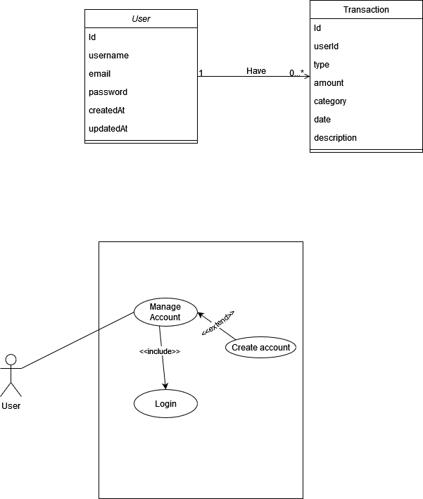

Personal Budget Tracker app allows users to input their incomes and expenses, categorize them, and visualize their spending patterns over time. It will help users stay on top of their budget by providing clear insights into their financial situation. The backend will be powered by MongoDB to store user data, transactions, and categories.
 

